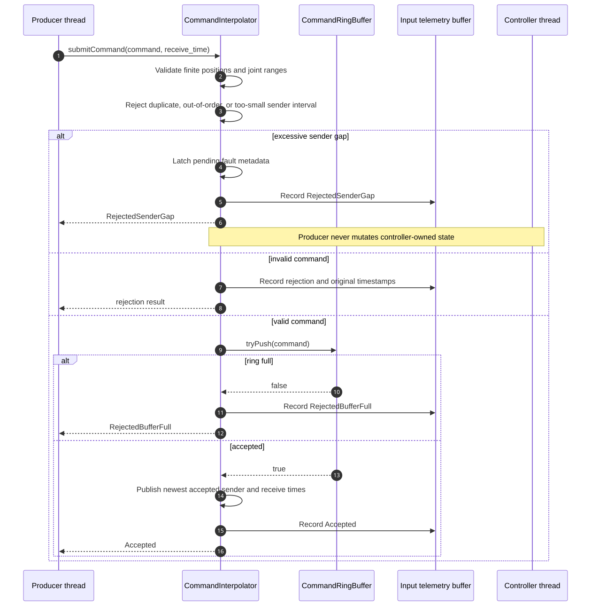
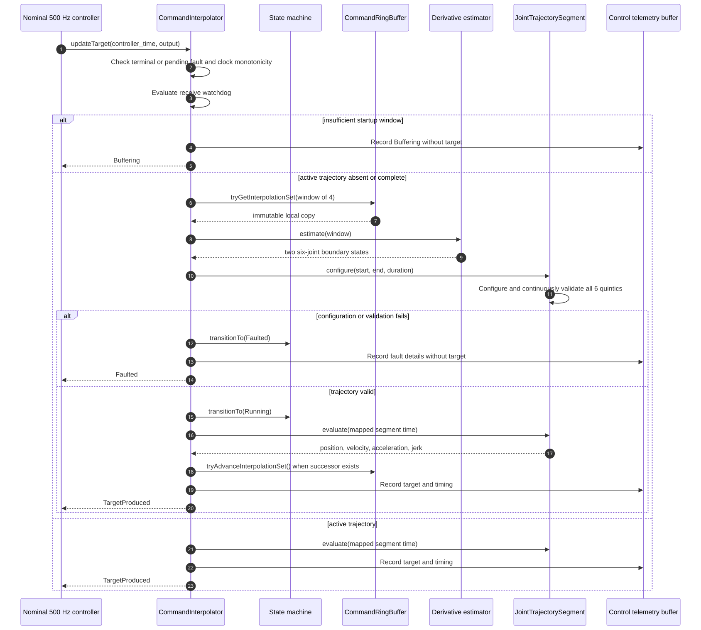
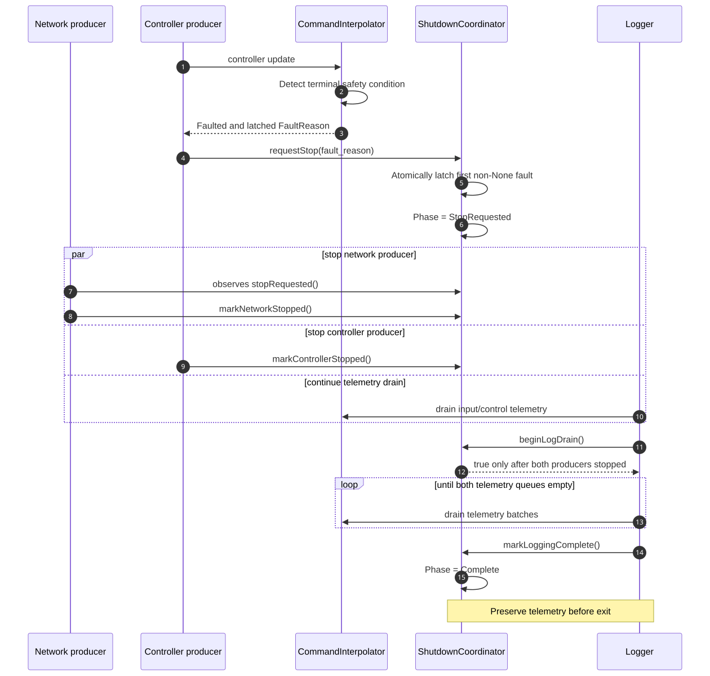

# Teleoperation Command Interpolator

**Design, safety rationale, verification record, and adversarial-testing handoff**

Author and maintainer: Mark Strachan<br>
Version 1.0 - September 2026<br>
Status: publication candidate; ten test executables passing at the verified source baseline<br>
Verified source baseline: public `v1.0.0` release candidate, tested September 26, 2026

> **Safety boundary:** This is a software design and test artifact, not a certified robot controller. The included joint limits are fictional. No hardware plant, drive, emergency-stop circuit, safety PLC, fieldbus, operating-system real-time guarantee, or formal safety case has been validated.

## Executive introduction

The Teleoperation Command Interpolator is an independent educational C++17 system for studying how a lower-frequency, jittery command stream can feed a bounded target-update path on a nominal 500 Hz schedule. A producer supplies six-joint `TargetCommand` values at approximately 15–30 Hz. A fixed-capacity SPSC command buffer preserves ordered transfer without blocking the controller, while a four-command lookahead window provides the neighboring samples needed to estimate segment-boundary velocity and acceleration.

The controller maps its monotonic clock onto the sender timeline once enough commands are buffered. It then builds a six-joint trajectory as one transaction: derivative estimation defines shared boundary states, six quintic segments are constructed, and the complete interval is checked for position, velocity, acceleration, and jerk limits before any target is published. The state machine makes buffering, running, temporary holding, and terminal fault behavior explicit.

Two fixed-layout telemetry streams preserve input and controller evidence without adding formatting work to either producer. Deterministic virtual time supports exact replay; a three-thread harness exercises process-local scheduling, telemetry drain, and orderly shutdown. Together, the source, ten behavioral suites, diagrams, and immutable reporting path provide a concrete system for code review, numerical testing, and future adversarial-testing research.

The sections that follow move from the whole-system structure and runtime interactions to the decisions behind them, then catalogue each class, its verification evidence, and the failure hypotheses reserved for later investigation.

## 1. Whole-system class diagram



The design separates five operational concerns:

1. bounded single-producer/single-consumer transfer;
2. command validation, state ownership, and time-domain mapping;
3. derivative estimation and continuously validated trajectory construction;
4. deterministic and real-thread execution harnesses;
5. loss-accounted telemetry, orderly shutdown, and immutable reporting.

The central rule is that the nominal 500 Hz controller thread owns controller state. A network-like producer may validate and enqueue a command, publish atomic observations, and latch a pending fault, but it does not directly transition the controller state machine.

## 2. Use cases



### 2.1 Primary actors

| Actor | Goal | Interface |
|---|---|---|
| Command producer | Submit time-ordered six-joint targets without blocking the controller | `submitCommand` |
| Nominal 500 Hz controller | Obtain the next validated target with deterministic bounded work | `updateTarget` |
| Telemetry consumer | Drain input and control evidence without blocking either producer | telemetry drain methods |
| Test engineer or test agent | Execute reproducible scenarios, inject timing and value faults, and compare outcomes | virtual-time and real-time harnesses |
| Robot integrator or operator | Supply real limits and define the external safe-stop action | configuration boundary outside this toy project |

### 2.2 Intended outcomes

- Reject malformed, duplicate, stale, too-fast, or unbufferable commands at ingress.
- Preserve the sender's intended time flow without subtracting unrelated clock epochs.
- Produce position-, velocity-, and acceleration-continuous six-joint target segments while checking jerk limits over each complete segment.
- Reject an entire six-joint trajectory transaction if any joint violates a continuous limit.
- Hold the last valid target during a temporary underrun.
- Make faults terminal for a controller session.
- Stop command and controller producers while allowing telemetry to drain completely.
- Produce stable, machine-readable evidence for later LangGraph and DSPy analysis.

## 3. Runtime sequences

### 3.1 Command ingress



Ingress deliberately performs inexpensive checks before touching the command buffer. A command is accepted only if all six positions are finite and within the configured position limits, its sender timestamp is strictly newer than the last accepted timestamp, its interval is not below the configured minimum, and the bounded ring has capacity.

An excessive sender interval is different from an ordinary invalid sample. It suggests the sender's intended trajectory has a discontinuity too large to bridge safely. The producer rejects the command and atomically publishes a pending fault. The controller consumes that pending fault and performs the state transition on its next update. This preserves single-thread state ownership.

### 3.2 Controller update and trajectory construction



The interpolation window contains four sender commands. The middle two commands define the active segment; the preceding and succeeding commands provide the local context needed to estimate boundary velocity and acceleration. Estimating both shared boundaries from the same samples gives adjacent segments identical position, velocity, and acceleration at their join.

Trajectory construction is transactional. All six scalar quintics are built and continuously validated before the new `JointTrajectorySegment` becomes active. A failed joint cannot leave five newly configured joints combined with one old joint.

### 3.3 Fault and shutdown lifecycle



`Faulted` is terminal for the current controller session. Terminal does not mean "terminate immediately and lose evidence." The `ShutdownCoordinator` first requests producer shutdown, waits until the network and controller producers report stopped, allows the logger to drain both queues, and only then enters `Complete`.

### 3.4 State machine



| State | Meaning | Output policy |
|---|---|---|
| `Buffering` | Fewer than four usable commands, or no valid trajectory yet | No new target is claimed |
| `Running` | A validated trajectory is active | Publish evaluated target |
| `Holding` | Temporary receive silence or no successor | Preserve the last valid target |
| `Faulted` | Terminal safety or consistency failure | Publish no new target; retain fault evidence |

No transition returns to `Buffering` after execution begins. Recovery from `Faulted` requires a new controller session and explicit external reset policy; the class intentionally has no implicit reset.

## 4. Architectural decisions and reasoning

### 4.1 Use bounded SPSC rings for deterministic transfer

The command and telemetry paths use fixed-capacity arrays with monotonically increasing logical counters and modulo physical indexing. Their work is bounded, no element shifting is required, and no allocator or mutex participates in the frequency-sensitive update path.

The command path has exactly one producer and one consumer. That makes a general multi-producer queue unnecessary. Release stores publish completed slot writes; matching acquire loads make those writes visible to the other thread. `memory_order_acquire` is not a lock and does not wait for another thread to "release" an atomic variable. It constrains visibility and ordering of the ordinary storage writes associated with the published index.

The logical counters are unsigned. Their subtraction remains valid across unsigned wrap while the live distance remains less than half the counter range, which is overwhelmingly true for a small bounded ring. Requiring power-of-two capacity keeps physical indexing behavior regular and makes the wrap assumption explicit.

### 4.2 Retain a four-command lookahead window

Two positions are sufficient to interpolate position but insufficient to infer smooth boundary derivatives. Four positions provide one sample on each side of the active pair. The ring retains the lookback portion of the window when advancing, so the consumer can construct adjacent segments without mutable references into producer-owned storage.

The consumer copies the small window into local storage. This is intentional. Returning references to ring slots would allow the producer eventually to overwrite data while the controller was still using it. A bounded copy of four fixed-size commands is simpler and safer than extending slot lifetimes or adding locks.

### 4.3 Distinguish sender time from controller time

`SenderTime` and `ControllerTime` are distinct types. Their epochs need not agree. The system never interprets `controller_time - sender_time` as network latency.

When the first valid interpolation window becomes available, the controller maps a controller-time origin onto a sender-time origin. Subsequent elapsed controller time is applied to the sender timeline. This retains the sender's intended spacing without injecting receive jitter into every target timestamp.

`received` time remains important for the watchdog and telemetry. It can measure receiver-side silence and, when clock synchronization is known externally, can support latency, jitter, and drift analysis. The class itself makes no synchronization claim.

### 4.4 Reject unsafe input; do not silently clamp it

Silently clamping a target would convert an invalid command into a plausible-looking command and conceal a contract violation. Ingress therefore rejects non-finite or out-of-range positions. Continuous trajectory validation separately catches overshoot or excessive derivatives that are invisible at the command endpoints.

The fictional `DefaultToyJointLimits` exist only to make tests executable. A real integration must provide joint-specific units, topology, soft and hard position ranges, asymmetric velocity and acceleration limits where appropriate, jerk limits, and a policy for continuous revolute joints.

### 4.5 Use quintics and validate the whole interval

A fifth-degree polynomial can satisfy position, velocity, and acceleration at both endpoints. Its first and second derivatives are continuous across adjacent segments when shared boundary states match; jerk is finite but not necessarily continuous between independently constructed segments.

Endpoint checks alone are insufficient. A quintic can overshoot position limits or reach maximum velocity, acceleration, or jerk inside the segment. `QuinticValidator` finds relevant polynomial extrema on the normalized interval, maps them to physical time, and checks the complete interval.

The root search uses fixed-size arrays, degree-bounded recursion through derivative roots, and a bounded number of bisection iterations. There is no heap allocation or unbounded convergence loop in validation.

### 4.6 Make six-joint configuration transactional

`JointTrajectorySegment::configure` creates and validates candidate scalar segments first. Only after every joint succeeds does the object commit the new configuration. This provides an all-or-nothing invariant:

> A configured `JointTrajectorySegment` is a coherent six-joint trajectory whose complete interval has passed the configured position, velocity, acceleration, and jerk limits.

### 4.7 Separate input and control telemetry

Input events are produced by the network-like thread; control events are produced by the controller thread. Each stream therefore has its own SPSC telemetry buffer. Merging them into one ring would create two producers and invalidate the SPSC proof.

Telemetry records are fixed-layout, trivially copyable structs. They record outcomes and failure details without formatting text in the real-time path. Dropped sample counts are explicit. CSV conversion is deferred to the report writer.

### 4.8 Allocate large telemetry buffers at construction, not during updates

The telemetry buffers are held by `std::unique_ptr`. This incurs controlled allocation during object construction while keeping the interpolator object and typical caller stack frames smaller. No allocation occurs in command ingestion or controller evaluation.

### 4.9 Provide deterministic and real-thread harnesses

The virtual-time harness is the primary correctness oracle. It uses one event loop, explicit timestamps, no sleeping, and exact tick counting. A failure can be replayed exactly.

The real-time harness answers a different question: whether the design behaves coherently with three process-local threads, scheduler jitter, interruptible waits, and coordinated log drain. The wait policy is selectable so the portable condition-variable path can be compared directly with the Windows high-resolution waitable timer. A caller may also request controller-thread affinity to one logical processor on Windows; the result records whether that request was applied, unsupported, invalid, or failed.

Every executed controller tick retains its scheduled offset, actual start offset, nonnegative lateness, and `updateTarget` duration. The result derives nearest-rank p50, p95, and p99 lateness values and preserves the maximum. The standalone `timing_qualification` tool repeats identical one-second trials, rotates configuration order to reduce systematic first-run bias, and emits comparison-ready CSV for portable, automatic, and optionally pinned configurations. These facilities measure scheduler behavior; they do not prove a hard real-time deadline or alter thread priority.

### 4.10 Make reports immutable and schema-stable

`RunReportWriter` writes to a sibling staging directory and atomically renames the completed directory. It refuses to overwrite an existing report. Partial output cannot masquerade as a completed run, and prior failure evidence is preserved.

The CSV schema uses stable enum names and explicit empty fields for absent failure indices. Non-finite values in deliberately malformed test data have consistent textual representations.

## 5. Detailed class catalog

### 5.1 Buffer and record types



#### `CommandRingBuffer<Capacity, LookbackWindow>`

**Responsibility:** Transfer ordered `TargetCommand` values from one producer to one consumer while retaining a fixed interpolation window.

**Important members:** fixed `storage_`; producer-owned atomic `write_position_`; consumer-owned atomic `read_head_position_` initialized to `LookbackWindow - 1`.

**Methods:**

- `tryPush` copies one complete command into the next slot and release-publishes the write counter.
- `hasInterpolationWindow` reports whether the requested lookback is available.
- `tryGetInterpolationSet` copies the stable window into caller-owned fixed storage.
- `tryAdvanceInterpolationSet` advances only when a successor will remain available.

**Invariants:** one producer, one consumer; capacity greater than lookback; lookback between two and five; power-of-two capacity; lock-free index atomics on the target platform.

#### `TelemetryRingBuffer<Sample, Capacity>`

**Responsibility:** Transfer one telemetry stream from its producer to a high-throughput logger.

**Important members:** fixed storage; atomic producer and consumer counters; atomic dropped-sample count.

**Methods:** `tryPush`, batch-oriented `tryPopBatch`, `available`, and `droppedSampleCount`.

**Design note:** Full telemetry is dropped and counted rather than blocking a real-time producer. The buffer does not claim cross-process shared-memory semantics.

### 5.2 Trajectory subsystem



#### `CommandDerivativeEstimator`

**Responsibility:** Convert four time-ordered position commands into start and end position/velocity/acceleration boundary states for the middle interval.

**Method:** static `estimate` validates timestamps and positions, computes nonuniform quadratic three-point derivatives, and returns a detailed status including failed command and joint.

**Why stateless:** Every output depends only on the supplied window. Statelessness improves replay, test isolation, and future parallel scenario execution.

#### `QuinticSegment`

**Responsibility:** Configure and evaluate one scalar fifth-degree polynomial.

**Members:** six coefficients, duration, configured flag.

**Methods:** `configure`, `evaluate`, `isConfigured`, `durationSeconds`.

**Failure hygiene:** A failed reconfiguration clears validity, so old coefficients cannot accidentally remain usable. Evaluation rejects non-finite or out-of-interval time.

#### `QuinticValidator`

**Responsibility:** Prove, within its numerical algorithm and tolerances, that one configured scalar quintic stays inside position, velocity, acceleration, and jerk limits over its complete closed interval.

**Method:** static `validate` returns category, extremum time, and extremum value.

**Numerical approach:** Normalize polynomial coefficients, recursively isolate roots using derivative roots, merge nearly duplicate roots, bisect with a fixed 80-iteration bound, and evaluate endpoints plus internal extrema.

#### `JointTrajectorySegment`

**Responsibility:** Configure, validate, and evaluate six scalar trajectories as one atomic unit.

**Members:** six joint limits, six `QuinticSegment` objects, duration, configured flag.

**Methods:** `configure`, `evaluate`, state accessors, and private limit/boundary validation.

**Error localization:** Status reports identify the joint, time, and value associated with a rejected boundary, continuous-limit violation, or evaluation failure.

### 5.3 Control and lifecycle subsystem



#### `InterpolatorStateMachine`

**Responsibility:** Enforce the allowed lifecycle and reject accidental transitions.

**Member:** current `InterpolatorState` initialized to `Buffering`.

**Methods:** `state`, `transitionTo`, and private `isAllowed`.

**Policy:** Self-transition is idempotent. `Faulted` accepts only itself. There is deliberately no reset method.

#### `ShutdownCoordinator`

**Responsibility:** Coordinate an orderly multi-thread stop while preserving terminal telemetry.

**Members:** atomic shutdown phase, first fault reason, and producer-stopped flags.

**Methods:** request normal or fault stop, query state, mark producers stopped, begin log drain, and mark logging complete.

**Policy:** The first non-`None` fault wins. Logging cannot complete before draining begins, and draining cannot begin until both telemetry producers are stopped.

#### `CommandInterpolator`

**Responsibility:** Own the command contract, controller state, clock mapping, watchdog, interpolation window, active trajectory, target publication, and two telemetry streams.

**Principal members:** state machine; 16-slot four-command ring; 256-sample input telemetry ring; 4096-sample control telemetry ring; four-command local window; last target; sender/controller origins; active six-joint trajectory; limits and timing configuration; pending and latched fault metadata.

**Public methods:** `submitCommand(TargetCommand)`, `submitCommand(TargetCommand, ControllerTime)`, `updateTarget(ControllerTime, JointPositions&)`, state/fault inspection, telemetry drains, and telemetry counts.

**Private flow:** validate and accept command; calculate next result; configure or evaluate active trajectory; record fixed telemetry; enter terminal fault; publish target only after successful evaluation.

**Concurrency contract:** exactly one thread calls ingress, exactly one thread calls controller update, and exactly one logger consumes each respective telemetry ring. Object destruction occurs only after all users have stopped.

### 5.4 Harness and reporting subsystem



#### `VirtualTimeHarness`

**Responsibility:** Execute scheduled deliveries and controller ticks in deterministic virtual time.

**Method:** `run` validates scenario ranges/order/budget, processes events in a fixed order, drains telemetry, coordinates shutdown, and returns full evidence.

#### `RealTimeHarness`

**Responsibility:** Exercise network, nominal 500 Hz controller, and logger roles on three actual process-local threads.

**Method:** `run` validates periods and schedule, applies startup delay, selects and records the requested and actual wait strategies, optionally applies Windows controller-thread affinity, captures one timing sample per executed tick, derives lateness percentiles, and returns drained telemetry plus aggregate metrics.

#### `RunReportWriter`

**Responsibility:** Serialize a `RealTimeRunResult` into a complete, non-overwriting, versioned report directory.

**Method:** `write` produces `summary.csv`, `input_telemetry.csv`, `control_telemetry.csv`, and `controller_timing.csv` through temporary files and a staging directory, then atomically finalizes the directory.

## 6. Data model and result taxonomy

### 6.1 Clock-domain types

- `SenderTime`: signed 64-bit nanoseconds in the sender's unspecified epoch.
- `ControllerTime`: signed 64-bit nanoseconds in the receiver/controller clock domain; `now()` uses `std::chrono::steady_clock`.
- `TargetCommand`: sender dispatch time, controller receive time, and six positions.

Signed 64-bit nanoseconds make comparisons explicit and avoid floating-point loss for large epochs. Durations are converted to `double` seconds only at the numerical trajectory boundary.

### 6.2 Ingress results

`CommandResult` distinguishes acceptance from non-finite positions, out-of-range positions, duplicate or out-of-order sender time, too-small interval, excessive sender gap, and full command buffer. Distinct results are essential for telemetry classification and adversarial test scoring.

### 6.3 Controller results

`ControlResult` is one of `Buffering`, `TargetProduced`, `Holding`, or `Faulted`. The result is not interchangeable with state: every control call also records whether a target was actually produced.

### 6.4 Fault reasons

Faults include excessive sender gap; receive timeout; controller clock regression; command-buffer inconsistency; invalid segment timing; illegal state transition; missing hold target; excessive advancement; derivative-estimation failure; trajectory configuration or evaluation failure; and continuous position, velocity, acceleration, or jerk limit violations.

The taxonomy intentionally separates root causes that may lead to the same `Faulted` state. Automated test agents should optimize for discovering distinct fault mechanisms, not merely maximizing the number of faulted runs.

### 6.5 Telemetry records

`InputTelemetrySample` records both time domains, six positions, and ingress result. `ControlTelemetrySample` records controller time, target positions, segment timing, result/state/fault, failed command/joint indices, failure time/value, and an explicit `has_target` bit. Sentinel constants are used only inside the fixed record; CSV output uses empty fields when failure details are absent.

## 7. Configuration and toy defaults

| Parameter | Toy default | Intended policy |
|---|---:|---|
| Minimum sender interval | 10 ms | Reject implausibly dense or duplicate-like commands |
| Maximum sender interval | 100 ms | Reject and fault rather than bridge a large intended-time discontinuity |
| Hold timeout | 150 ms | Preserve the last valid target during brief receive silence |
| Fault timeout | 500 ms | Enter terminal `Faulted` after prolonged receive silence |
| Command buffer capacity | 16 commands | Bounded lookahead without excessive latency |
| Lookahead window | 4 commands | Estimate both boundaries of the middle segment |
| Input telemetry capacity | 256 samples | Absorb ingress bursts for the process-local logger |
| Control telemetry capacity | 4096 samples | Cover a longer nominal 500 Hz logging interval |

All durations must be positive and the fault timeout must exceed the hold timeout. Scenario-specific values can be injected through `InterpolatorConfiguration`.

## 8. Verification record

At the verified source baseline, a clean CMake Release build produced ten test executables and CTest reported ten of ten passing. The tests are ordinary deterministic C++ executables with explicit assertions and nonzero failure exit codes.

| Verification field | Recorded value |
|---|---|
| Date | September 26, 2026 |
| Source baseline | Public `v1.0.0` release candidate |
| Compiler | Microsoft C/C++ 19.50.35720.0, x64 |
| Visual Studio toolset | Visual Studio 2026 18.1; MSVC 14.50.35717 |
| Windows SDK | 10.0.26100.0 |
| Generator | Visual Studio 18 2026, x64 |
| Configuration | Release, C++17, `/W4 /permissive-` |
| Result | 10/10 CTest suites passed |

The checked-in `msvc-release` preset configured the Visual Studio generator, built the Release configuration, and ran the complete CTest suite. The timing-qualification executable was then built and exercised in portable, automatic high-resolution, and affinity-pinned modes.

### 8.1 `InterpolatorStateMachineTests`

Tests initial `Buffering`; valid `Buffering -> Running`, `Running -> Holding`, `Holding -> Running`, and transitions to `Faulted`; rejection of skipped or backward transitions; idempotent self-transitions; and terminal `Faulted` behavior.

**Why:** A safety policy expressed as scattered conditionals is difficult to audit. The transition table is small enough to test exhaustively.

### 8.2 `ShutdownCoordinatorTests`

Tests normal and fault stop requests; first-fault latching; producer-stop observation; prohibition on log completion before drain; waiting for both producers; pre-stopped producer ordering; and terminal `Complete` for normal and fault lifecycles.

**Why:** Immediate process exit can discard the exact telemetry needed to explain a fault. Shutdown ordering is therefore a correctness property.

### 8.3 `QuinticSegmentTests`

Tests canonical smooth-step values at start, midpoint, and end; arbitrary boundary reproduction; continuity between joined segments; duration retention; rejection of zero, negative, infinite, or numerically unsafe duration; non-finite boundaries and evaluation time; interval bounds; unconfigured evaluation; failed-reconfiguration invalidation; and valid recovery.

**Why:** The scalar polynomial is the numerical foundation. Exact known values detect coefficient, derivative, time-scaling, and Horner-evaluation errors.

### 8.4 `CommandDerivativeEstimatorTests`

Tests uniform and nonuniform timestamp windows; exact start/end positions; quadratic derivative velocity and acceleration; identical shared boundaries between sliding windows; duplicate timestamps; non-finite positions; non-finite estimates; and precise failure command/joint localization.

**Why:** Lookahead only improves smoothness if adjacent estimates agree. Nonuniform sampling is necessary because sender intervals are bounded but not assumed constant.

### 8.5 `QuinticValidatorTests`

Tests a safe complete interval; interior position overshoot; interior velocity maximum; interior acceleration maximum; interior jerk minimum; physical time/value reporting; normalized-time operation for short segments; degenerate constant polynomials; invalid limits; and unconfigured segments.

**Why:** Endpoint-only tests miss the most important spline failure mode: an unsafe internal extremum between two individually valid commands.

### 8.6 `JointTrajectorySegmentTests`

Tests six-joint configuration and evaluation; midpoint position/velocity/acceleration/jerk; boundary reproduction; invalid duration; non-finite and unordered limits; non-finite and out-of-range boundary state; continuous position, velocity, acceleration, and jerk violations; failed-joint/time/value localization; whole-trajectory transactional rejection; and evaluation failure.

**Why:** Scalar correctness does not prove coherent six-axis behavior. Transactional rejection prevents mixed old/new trajectory state.

### 8.7 `CommandInterpolatorTests`

Tests startup buffering; transition to target production; sender/controller epoch independence; interior interpolation; duplicate, out-of-order, too-small, excessive-gap, non-finite, infinite, out-of-range, and buffer-full ingress; recovery interval measured from the last accepted command; holding and resume; exact receive watchdog thresholds; controller clock regression; pending producer fault consumed by controller; unsafe derivative trajectory fault before publication; unchanged caller output on fault; failure metadata; one telemetry event per input/control call; telemetry drain; and concurrent receive ordering without an invented clock fault.

**Why:** This suite verifies the integration contract and thread-ownership decisions, including negative guarantees such as "do not modify output" and "producer does not transition state."

### 8.8 `VirtualTimeHarnessTests`

Tests healthy jittered completion; exact 500 Hz inclusive tick count; deterministic target at a selected tick; exact timeout at 500 ms; complete telemetry capture and zero drops; faulted shutdown with final fault record drained; invalid ranges, nonpositive period, out-of-order schedule, and tick-budget exhaustion.

**Why:** Virtual time makes boundary behavior reproducible and fast enough for large adversarial scenario populations.

### 8.9 `RealTimeHarnessTests`

Tests a one-second healthy three-thread run at a nominal 500 Hz; the expected platform wait strategy; explicit portable-wait selection; unsupported or invalid affinity reporting; bounded scheduler-slot accounting; one timing sample per executed tick; ordered p50/p95/p99/maximum lateness; delivery count; sustained controller ticks; interpolated targets; captured input/control events; zero drops; configured periods and duration; measured controller lateness and call time; a reported observed controller rate; invalid controller period; unsafe trajectory fault; fault reason preservation; final terminal telemetry; and complete log-draining shutdown.

**Why:** Deterministic simulation cannot expose all mistakes in stop coordination, wait interruption, scheduler behavior, or SPSC ownership.

### 8.10 `RunReportWriterTests`

Tests empty-path rejection; existence of all four CSV files; temporary-file finalization; staging-directory atomic finalization; configuration and aggregate fields; stable wait and affinity names; per-tick scheduling evidence; timestamp and double precision; consistent non-finite test representation; absent failure fields; terminal failure details; and refusal to overwrite an existing report.

**Why:** Adversarial testing is only useful if evidence is complete, stable, and not silently replaced.

## 9. Language and library elements

| Element | Use | Reason |
|---|---|---|
| `std::array` | commands, joints, coefficients, ring storage, roots | Fixed size, contiguous storage, no per-update allocation |
| `std::atomic` | ring counters, fault publication, shutdown flags | Lock-free cross-thread publication under explicit ownership |
| acquire/release ordering | SPSC index handoff | Publish ordinary slot writes without a mutex |
| relaxed ordering | same-thread-owned counters and independent observations | Avoid unnecessary ordering while preserving atomicity |
| `static_assert` | capacities, power-of-two layout, trivial records, lock-free atomics | Turn platform/design assumptions into compile-time failures |
| `enum class` | results, states, faults, phases | Scoped, non-convertible categories suitable for stable reports |
| `std::chrono::steady_clock` | controller time | Monotonic receiver time unaffected by wall-clock adjustments |
| strong wrapper structs | sender and controller timestamps | Prevent accidental subtraction of unrelated epochs |
| `noexcept` | bounded numerical and state operations | Makes failure channels explicit and avoids exception unwinding in update paths |
| `std::unique_ptr` | large telemetry rings | Allocate once during construction; reduce stack/object footprint |
| templates | ring capacity/sample type | Compile-time layout and reuse without virtual dispatch |
| Horner evaluation | quintic and derivative values | Fixed, efficient polynomial evaluation |
| `std::filesystem` | report staging/finalization | Portable path construction and atomic same-volume rename |
| `std::thread`, Windows waitable timers, and condition variables | real harness | Exercise ownership and interruptible shutdown without busy spinning |

## 10. Behavioral scenarios

### 10.1 Planned and implemented

- Clean startup with a four-command interpolation window.
- Moderate delivery jitter with ordered sender timestamps.
- Commands arriving faster than the configured minimum.
- Duplicate and out-of-order sender timestamps.
- Unrelated sender and controller clock epochs.
- Temporary buffer underrun followed by recovery.
- Prolonged receive silence leading to a terminal fault.
- Large intended sender-time gap that must not be bridged.
- Endpoint-valid commands whose inferred trajectory violates derivative limits.
- Internal spline overshoot not visible at the endpoints.
- Full command ring and full telemetry ring behavior.
- Controller clock regression.
- Normal and fault-driven three-thread shutdown with log drain.
- Deterministic replay and immutable CSV evidence.

### 10.2 Considered but not implemented

- Hardware feedback, Kalman-filter state, following error, torque, temperature, and drive status.
- A safety-rated emergency-stop output and independent safety controller.
- Clock synchronization protocols or a declared maximum clock error.
- Continuous-angle topology and shortest-path unwrapping for revolute joints.
- Network transport, DDS, ROS 2 executors, shared memory, or gRPC.
- Cross-process ring buffers and crash-recovery semantics.
- Real-time operating-system scheduling, thread-priority policy, priority inversion analysis, process isolation, cross-platform topology-aware affinity, and memory locking.
- Dynamic retiming when a segment cannot satisfy limits at the requested duration.
- Jerk continuity across segments or higher-order snap constraints.
- Redundant sensor plausibility and plant-model validation.
- Authentication, authorization, replay protection, and adversarial network security.

## 11. Failure hypotheses for adversarial testing

The following are hypotheses, not confirmed defects. They form the first high-value test backlog.

### 11.1 Numerical hypotheses

1. Extremely short but accepted intervals may magnify derivatives enough to stress floating-point conditioning before ordinary limit rejection.
2. Near-multiple polynomial roots may challenge root merging or sign classification and cause a missed narrow extremum.
3. Very large absolute positions combined with very small motion may lose significant digits in coefficient construction.
4. Values exactly on a limit, within one or several units in the last place, may produce platform-dependent pass/fail behavior.
5. Signed timestamp arithmetic near `int64_t` limits may overflow before conversion if not guarded at every subtraction.
6. Unsigned ring-counter wrap is mathematically intended, but it has not been accelerated with a reduced-width counter test specialization.

### 11.2 Concurrency hypotheses

1. The SPSC design fails if a second ingress producer, controller consumer, or logger consumer is introduced accidentally.
2. Object destruction concurrent with any thread remains outside the ownership contract.
3. Rare producer/controller interleavings around pending fault publication and newest receive time may expose inconsistent failure metadata even if the state remains safe.
4. Telemetry capacity can be exhausted if the logger is delayed longer than the assumed interval; drop counting works, but the terminal record itself could be among dropped samples.
5. Windows scheduling stalls may make the real harness miss timing goals. Per-tick evidence now exposes those stalls, but the project intentionally has no universal pass/fail deadline threshold.

### 11.3 State and policy hypotheses

1. Holding the last target is not universally safe; gravity-loaded or unstable robots may require a drive-specific controlled stop.
2. A valid successor after holding may create a large error relative to actual hardware state even though the target-space trajectory is internally smooth.
3. Rejecting the first excessive-gap command and faulting on the next controller tick leaves a small interval where the producer knows more than the controller.
4. Buffer fullness currently rejects new information. Some systems may prefer dropping the oldest not-yet-active future command, but that changes safety and determinism.
5. Fixed global timing thresholds may be inappropriate for commands with explicitly variable intended rates.

### 11.4 Integration hypotheses

1. Unit mismatch between degrees and radians, or seconds and nanoseconds, can defeat otherwise correct limits.
2. A transport may deserialize missing or repeated protobuf fields into plausible defaults that ingress accepts.
3. ROS 2 callback/executor configuration may violate the assumed one-producer ownership.
4. Logger process separation requires an explicit transport and backpressure contract; the current ring cannot simply be placed in another process.
5. Hardware controllers may impose tighter velocity/acceleration/jerk constraints or their own interpolation, producing double interpolation.

## 12. LangGraph and DSPy adversarial-testing handoff

### 12.1 Objective

Build an intelligent test system that searches for distinct, reproducible violations of declared properties. The agents should not edit production code during discovery. Every candidate failure must first be reduced to a deterministic virtual-time scenario and then, where relevant, replayed in the real-thread harness.

### 12.2 Inputs available to agents

- This document and Mermaid design sources.
- C++ headers and implementations.
- Ten executable test suites.
- Scenario configuration structures.
- Input and control telemetry records.
- Immutable CSV report schema.
- CMake/CTest build and verification commands.

### 12.3 Candidate agent roles

| Role | Responsibility | Output |
|---|---|---|
| Property extractor | Convert design claims and invariants into executable predicates | versioned property catalog |
| Scenario generator | Produce command positions, timestamps, receive schedules, limits, and timing configuration | deterministic scenario seed |
| Numerical adversary | Target conditioning, extrema, limit boundaries, and timestamp ranges | minimized numerical counterexample |
| Concurrency adversary | Vary scheduling pressure, logger delay, and stop timing | replay recipe and race evidence |
| Oracle critic | Challenge whether a test's expected outcome actually follows from the specification | accepted/rejected oracle rationale |
| Reducer | Minimize failing commands, joints, duration, and event count | smallest deterministic reproducer |
| Coverage analyst | Track properties, result categories, state transitions, and fault reasons reached | coverage matrix |
| Human-review broker | Bundle only high-value decisions and runnable evidence | concise review packet |

### 12.4 DSPy optimization targets

DSPy should optimize structured modules rather than free-form "find bugs" prompts. Useful metrics include:

- percentage of generated scenarios that parse and execute;
- unique fault mechanisms discovered;
- confirmed invariant violations rather than expected rejections;
- deterministic reproduction rate;
- minimization quality;
- false-positive rate under oracle review;
- new branch/state/fault coverage per CPU-hour;
- human minutes required per confirmed issue.

Training examples should include both true defects and valid safety rejections. Otherwise the optimizer may learn that simply provoking `Faulted` is success.

### 12.5 LangGraph workflow

1. Load the design contract, source revision, property catalog, and prior findings.
2. Select an uncovered property or failure hypothesis.
3. Generate a bounded batch of virtual-time scenarios with recorded random seeds.
4. Build once, then execute scenarios in isolated worker directories.
5. Parse telemetry and apply deterministic predicates.
6. Route apparent violations to an independent oracle critic.
7. Minimize accepted violations while preserving exact reproduction.
8. Replay timing-sensitive cases in the real-thread harness many times.
9. Cluster failures by mechanism and discard duplicates.
10. Produce a human packet containing the claim, smallest input, expected versus actual behavior, relevant telemetry slice, one-command reproduction, and recommended priority.
11. After human acceptance, create a regression test before proposing a fix.
12. Re-run the complete suite and compare the quality score to the prior revision.

### 12.6 Safety properties to encode first

- No output position, velocity, acceleration, or jerk exceeds configured limits for a published trajectory sample.
- No target is claimed when the controller result is `Buffering` or terminal `Faulted`.
- Caller output remains unchanged on a trajectory-configuration fault.
- Accepted sender timestamps are strictly increasing and respect the minimum interval.
- The network producer never changes `InterpolatorState` directly.
- `FaultReason` is stable after the first terminal fault.
- `Faulted` never transitions to a non-fault state in the same session.
- The report cannot reach `ShutdownPhase::Complete` before both producers stop and telemetry drains.
- Adjacent successfully estimated segments have identical shared position, velocity, and acceleration.
- A rejected six-joint configuration leaves no partially committed trajectory.
- Every ingress and controller invocation produces exactly one corresponding telemetry event unless a documented telemetry drop occurs.
- Report writer failure or preexisting output never modifies the existing report.

### 12.7 Human review packet

Each notification should answer, in one screen where possible:

1. What design claim may be false?
2. Is the run deterministic?
3. What is the smallest reproducer?
4. Could the behavior damage hardware, lose evidence, or merely reduce quality?
5. What decision is required from the human?
6. What happens if the decision is deferred?

Routine expected rejections should remain in dashboards and not notify the human. Only new mechanisms, disputed specification questions, possible hardware hazards, and high-confidence regressions should interrupt.

## 13. Improvement loop

The project can be evolved as a scored sequence:

1. Freeze a source revision and report schema.
2. Run the deterministic and threaded baseline suites.
3. Run the adversarial batch under fixed CPU/time budgets.
4. Accept only independently reproduced findings.
5. Add regression tests before implementation changes.
6. Make one narrowly scoped design change.
7. Rebuild and run all prior tests plus the adversarial corpus.
8. Compare safety-property coverage, distinct findings, timing metrics, telemetry loss, and human review burden.
9. Keep the revision only if it improves the declared score without invalidating an intentional contract.

This protects against agents "improving" the score by weakening limits, suppressing faults, deleting difficult tests, or redefining expected outcomes.

## 14. Readiness assessment

### Suitable now

- C++ teaching and code-review exercise.
- Deterministic exploration of timestamp, interpolation, and state-machine behavior.
- Parallel virtual-time adversarial testing.
- Telemetry-schema and reporting experiments.
- Evaluation of LangGraph/DSPy testing workflows.

### Requires further engineering before hardware use

- Real robot and drive specifications.
- Explicit units and joint topology.
- Hardware-state feedback and following-error policy.
- Independent safe-stop integration.
- Real-time OS and scheduling analysis.
- Transport and serialization contract.
- Fault-tree analysis, hazard analysis, and requirements traceability.
- Static analysis, sanitizers, concurrency instrumentation, coverage, and platform matrix.
- Long-duration soak, counter-wrap acceleration, and power-loss recovery tests.
- Review by qualified robotics controls and functional-safety engineers.

## 15. Build and verification commands

From the repository root on the documented Windows/MSVC environment:

```powershell
cmake --preset msvc-release
cmake --build --preset msvc-release
ctest --preset msvc-release
```

The expected baseline is ten passing tests. The installed-package example under `examples/consumer` also verifies that a separate consumer can resolve the package and link through `teleoperation::command_interpolator`. Future documentation should record the source commit, compiler, platform, configuration, and exact test count rather than treating this historical result as automatically current.

<div class="page-break"></div>

## 16. Document maintenance

- Edit `TeleoperationCommandInterpolatorDesign.md` and the Mermaid files under `diagrams/src`.
- Regenerate every rendered SVG after diagram-source changes.
- Regenerate HTML and PDF after canonical Markdown changes.
- Visually inspect every PDF page for clipping, unreadable diagrams, orphaned headings, and stale references.
- Update test traceability when a test is added, removed, or changes intent.
- Bump the report schema version only for a deliberate machine-readable compatibility change.
- Treat this document as context for agents, not as authority to weaken production safety policy.

---

**Canonical source:** `docs/design/TeleoperationCommandInterpolatorDesign.md`<br>
**Diagram source:** `docs/design/diagrams/src/*.mmd`<br>
**Generated editions:** `docs/design/exports/TeleoperationCommandInterpolatorDesign.html` and `.pdf`
